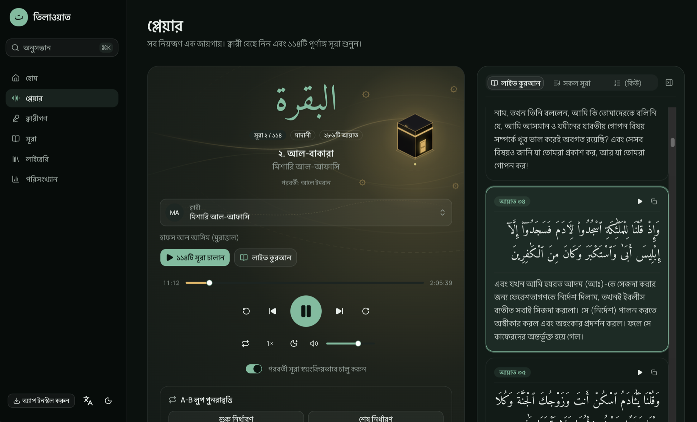

# Tilawah (তিলাওয়াত) — Quran Player

[](https://github.com/shahadot786/quran-player/actions/workflows/verify.yml)
[](https://tilawah.shahadot.dev)

Listen to the whole Quran, surah by surah, in the voices of more than 230 reciters, with the Arabic text and its Bengali translation following the recitation ayah by ayah. It resumes exactly where you stopped, works offline, and keeps everything you do on your own device.

**Live:** [tilawah.shahadot.dev](https://tilawah.shahadot.dev)



<sub>The player page in Bengali (dark theme). The Live Quran panel on the right has highlighted Ayah 34 because that is the ayah being recited at 11:12.</sub>

## Features

### Listening
- **Every reciter has all 114 surahs.** Recitations that are missing surahs are dropped, and reciters that mp3quran only offers in part are filled from other free sources (see [Data sources](#data-sources)).
- **A dedicated player** at `/player`: seek, ±10s skip, previous/next, speed (0.5×–2×), repeat, volume, a sleep timer (15, 30, 45 or 60 minutes, or end of surah) and auto-advance.
- **Play all 114 surahs** in order with one button, or start from any surah and continue to An-Nas.
- **Queue manager**: reorder, remove, shuffle, clear, or save the queue as a playlist.
- **Change reciter or recitation mid-surah** and keep your place.
- **A-B loop** to repeat a passage for memorization and tajweed practice.
- **Resume anywhere**: reload the page and the player is back at the same second, paused.
- **Lock-screen and headset controls** through the Media Session API, plus keyboard shortcuts (Space, ←/→, M).

### Live Quran
- The Arabic text with the Bengali translation, with the **current ayah highlighted and scrolled into view as it is recited**.
- Tap **Play from ayah N** on any ayah to jump there.
- The highlight only follows when real ayah timings exist for that exact recording, so it never guesses. See [How the sync works](#how-the-ayah-sync-works).

### Your library
- Favorite reciters and surahs, playlists (create, rename, reorder, play all), and listening history.
- **Stats**: time listened, surahs completed, current and longest streak, top reciters and a 7-day chart.
- **Backup**: export, import or reset all local data as JSON. There are no accounts and nothing leaves your device.

### Offline and installable
- **Download surahs** for offline listening, seeking included, and install the app on iOS, Android or desktop (PWA).

### Made for reading and listening
- **English and বাংলা** across the interface, reciter names and surah names, with light, dark and system themes.
- An ambient Kaaba visualizer on the player page.
- Server-rendered pages with a sitemap, `robots.txt`, OpenGraph and Twitter cards, and structured data.

## Data sources

| Source | Used for | Notes |
|---|---|---|
| [mp3quran.net](https://www.mp3quran.net/) | Most reciters and audio, and ayah timings | Downloadable for offline. |
| [quran.com](https://quran.com/) API v4 | A dozen more recitations, ayah timings, surah metadata | Downloadable for offline. |
| [islamic.network](https://islamic.network/) audio CDN | Reciters missing a complete recitation elsewhere | Streams, but sends no CORS headers, so these can't be downloaded. They are labeled "streaming only". |
| [alquran.cloud](https://alquran.cloud/) / quran.com | Arabic text and the Bengali translation | Cached on the device. |

The three audio catalogs are merged into one list: earlier sources win, and a later source only fills in a recitation the earlier ones don't have. Details are in `src/lib/api/merge.ts`.

## How the ayah sync works

A guessed position would highlight the wrong verse, so the Live Quran panel only follows recitations with real timing data:

1. **Timings are checked strictly.** The ayah count must match the surah, ayahs must be in order, and times can't go backwards. Anything irregular is rejected whole.
2. **They are checked against the audio.** The last ayah must end within a few seconds of the end of the file. Timings made for a different recording are off by tens of seconds or more and are refused.
3. **The highlight reads the audio clock every animation frame** while playing. Against the real Alafasi recording, ayahs lit up within 4–18 ms of their true boundaries.

About 100 reciters (roughly 100 recitations) can follow along. Reciters marked **Synced** in the picker do, and there is a "Synced recitations only" filter. The others still play normally, and the panel says sync isn't available for them.

## Tech stack

- **Framework**: [Next.js 16](https://nextjs.org/) (App Router, Turbopack) and [React 19](https://react.dev/)
- **Styling**: [Tailwind CSS v4](https://tailwindcss.com/) with [shadcn/ui](https://ui.shadcn.com/)
- **State**: [Zustand](https://zustand-demo.pmnd.rs/) persisted to localStorage, with IndexedDB and the Cache API for downloads
- **i18n**: [next-intl](https://next-intl.dev/) with `messages/en.json` and `messages/bn.json`
- **PWA and offline**: [Serwist](https://serwist.pages.dev/) (`@serwist/turbopack`)
- **Tests**: [Vitest](https://vitest.dev/) and [Playwright](https://playwright.dev/)

## Getting started

### Prerequisites

- Node.js 22 or later
- [Yarn 1](https://classic.yarnpkg.com/) (the repo uses `yarn.lock`)

### Install and run

```bash
git clone https://github.com/shahadot786/quran-player.git
cd quran-player
yarn install
cp .env.example .env.local
yarn dev
```

Open [http://localhost:3000](http://localhost:3000).

### Environment

| Variable | Purpose | Default |
|---|---|---|
| `NEXT_PUBLIC_SITE_URL` | Canonical URLs, sitemap, `robots.txt` and OpenGraph tags | `https://tilawah.shahadot.dev` |

### Scripts

| Command | What it does |
|---|---|
| `yarn dev` / `yarn build` / `yarn start` | Run, build and serve the app |
| `yarn lint` | ESLint |
| `yarn typecheck` | Generates Next's route types, then runs `tsc --noEmit` |
| `yarn test` | Unit tests (Vitest) |
| `yarn test:e2e` | End-to-end tests (Playwright) on a production build at port 3100 |
| `yarn surahs` | Regenerate `src/data/surahs.json` |
| `yarn sources` | Re-check which islamic.network recitations have all 114 files (`src/data/islamic-network.json`) |
| `yarn timings` | Re-validate ayah timings for every recitation (`src/data/synced-recitations.json`) |

The three data files are committed. Only re-run `sources` and `timings` when you want to pick up upstream changes.

## Quality checks

Everything below also runs in GitHub Actions on every push and pull request:

```bash
yarn lint
yarn typecheck
yarn test
yarn build
yarn test:e2e
```

The end-to-end tests stub the audio and the timing and text APIs, so they don't depend on any CDN. They run at desktop and mobile sizes.

## Project layout

```
src/app/            routes, API routes (/api/reciters, /api/timings), manifest, sitemap, service worker
src/components/     UI: player, player-page, library, stats, layout, shadcn ui
src/hooks/          audio engine, media session, ayah sync
src/lib/            audio URLs, catalog merging, timings, downloads, backup, stats
src/stores/         persisted Zustand stores (player, library, settings, stats, downloads)
src/data/           bundled surah metadata, recitation and timing lists
messages/           en.json, bn.json
e2e/                Playwright tests
scripts/            data refresh scripts
```

## Deployment

The app deploys on [Vercel](https://vercel.com):

1. Import the `quran-player` repository.
2. Optionally set `NEXT_PUBLIC_SITE_URL` (the default is already `https://tilawah.shahadot.dev`). If you set it, use the production domain.
3. Deploy. The production domain is [tilawah.shahadot.dev](https://tilawah.shahadot.dev).

## Contributing

Contributions are welcome. Read [CONTRIBUTING.md](CONTRIBUTING.md) for conventions, the branching model and how pull requests are merged. `master` is protected: every change goes through a pull request with passing CI.

## License

Released under the [MIT License](LICENSE).
